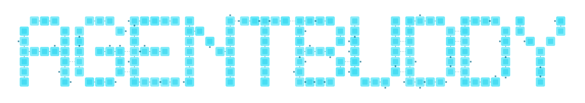

  

A local-first desktop app for building and running AI agent workflows using an actor-based architecture.

---

## Download

Download the latest release from the [Releases page](https://github.com/spankyed/AgentBuddy-releases/releases/latest).

| Platform | Architecture | Format |
|----------|-------------|--------|
| macOS | Apple Silicon (arm64) | `.dmg` |
| Windows | x64 | `.exe` |

<!-- Linux builds coming soon -->

## System Requirements

- macOS 12+ (Apple Silicon)
- Windows 10+ (x64)

## Getting Started

1. Download the installer for your platform from the [latest release](https://github.com/spankyed/AgentBuddy-releases/releases/latest)
2. Install and open AgentBuddy
3. Start building workflows

## Extending

AgentBuddy can be customized by modifying the [Default Setup](https://github.com/spankyed/default-setup) — the source for all built-in actions, prompts, flows, library docs, and settings.

1. Clone the [default-setup](https://github.com/spankyed/default-setup) repo
2. Edit the source files (or point a coding agent at the repo and describe your changes)
3. Compile with `npm run compile`
4. In AgentBuddy, go to **Settings > General > Application**, scroll to the bottom, and click **Import Setup Pack** — select the compiled `dist/` folder

See the default-setup repo's [docs](https://github.com/spankyed/default-setup#readme) for authoring guides on actions, prompts, and flows.

Numerous more ways to extend and customize the app are still being actively planned/developed.

> **Windows note:** The app is not yet code-signed, so Windows SmartScreen may show a warning. Click "More info" → "Run anyway" to proceed.

## Features

- **Actor-based architecture** — XState state machines drive frontend and backend through a typed event bus
- **Custom LLM integrations** — Connect to Anthropic, OpenAI, and Google models via the Vercel AI SDK
- **Visual node editor** — Design agent flows with drag-and-drop canvas
- **Embedded terminal** — Run commands directly inside the app
- **Thread-based conversations** — Persistent, resumable coding sessions
- **Interactive tool approval** — Approve or deny edit, write, and bash actions
- **Plugin system** — Extend the app with custom canvas views, panels, and state machines
- **Much more**

## FAQ

Do I need an API key?

Not necessarily. AgentBuddy integrates with the Claude Code CLI, so you can use your existing Anthropic subscription. OpenAI Codex integration is in development. You can also connect directly with your own API key (Anthropic, OpenAI, or Google) in **Settings**.

Is my data stored locally?

Yes. All data stays on your machine — secrets, conversations, workflows, and settings are persisted locally via an embedded database. We do not host any servers and the app does not share data with any third-party providers. All third-party integrations must be handled by the user. 

Can I customize the built-in actions and prompts?

Yes. The [Default Setup](https://github.com/spankyed/default-setup) repo contains the source for all built-in actions, prompts, flows, and library docs. You can fork it, modify it, compile it, and import your custom setup pack via **Settings > Import Setup Pack**.

Why isn't the source code available?

AgentBuddy is currently in an early testing phase. The full source code is planned to be released on June 19th, 2026.

What models are supported?

Any model available through Anthropic, OpenAI, or Google APIs via the Vercel AI SDK.

Is Linux supported?

Not yet — only macOS and Windows builds are available currently. Linux support is planned.

## Links

- [Source & Documentation](https://github.com/spankyed/AgentBuddy)
- [Default Setup](https://github.com/spankyed/default-setup) — built-in actions, prompts, flows, and library docs
